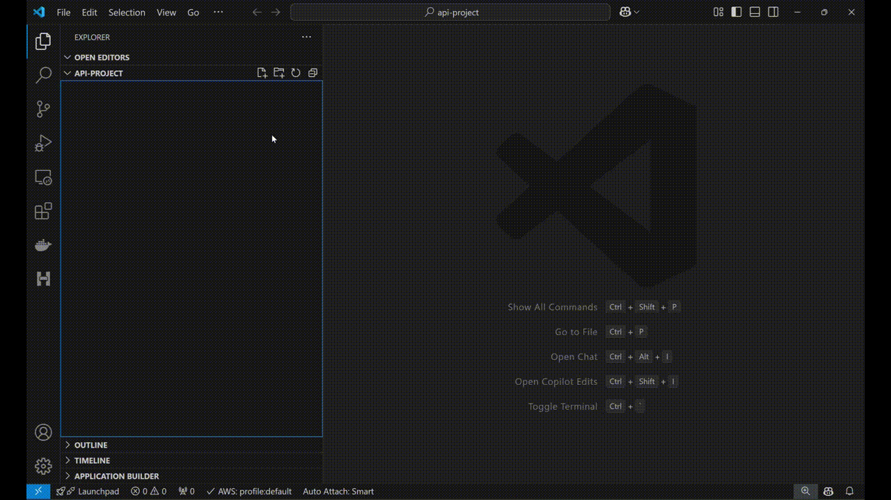
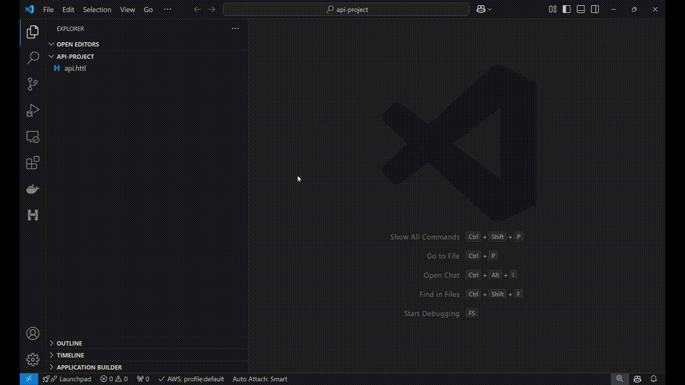

# HTTL for Visual Studio Code

[The VS Code HTTL extension](https://marketplace.visualstudio.com/items?itemName=HTTL.httl-vscode)
provides rich language support for the
[HTTL programming language](https://httl.dev/).

## What is HTTL?

If you ask ChatGPT — or, back in the day, Google — 'What is an HTTP programming language?' they respond that HTTP is not a programming language.

But wait — while it's true that HTTP itself isn't a programming language, why don't they suggest a language that can be used for writing HTTP requests? Consider how SQL allows you to retrieve data from a database or how Terraform lets you write infrastructure code without worrying about specific details.

**Imagine a language that:**

- Is simple and intuitive.
- Is smart enough to offer IntelliSense for OpenAPI.
- Is flexible — you can save responses as variables and use them as building blocks for headers or body content in follow-up requests.
- Provides a native way to write test scenarios without mixing in JavaScript or Python.

 

🚀🚀🚀 **Introducing HTTL** 🎉

This is the first HTTP programming language that allows you to write code to query and test web APIs, replacing the need for UI tools like Postman or Insomnia.

Ready to code smarter? Let’s dive in! 🚀  

## Quick Start

1.  Install the [The VS Code HTTL extension](https://marketplace.visualstudio.com/items?itemName=HTTL.httl-vscode).

2.  Create or Open *.httl file to activate the extension.

3.  Write a simple query e.g. `get https://httpbin.org/anything` and press F5 or CTRL|CMD+Enter

 
<em>(HTTL file)</em>

1. Alternatively, you can open the `Quick Run` panel if you don't want to create a file.
  <em>NOTE: Some features, such as IntelliSense and formatting, are not supported.</em>
   

 
<em>(Quick Run)</em>

Happy coding! :-) &nbsp;&nbsp; 🎉🎉🎉

## What's next

Visit [Our website](https://httl.dev/) for complete documentation

## License

[LICENSE](./LICENSE.md)
